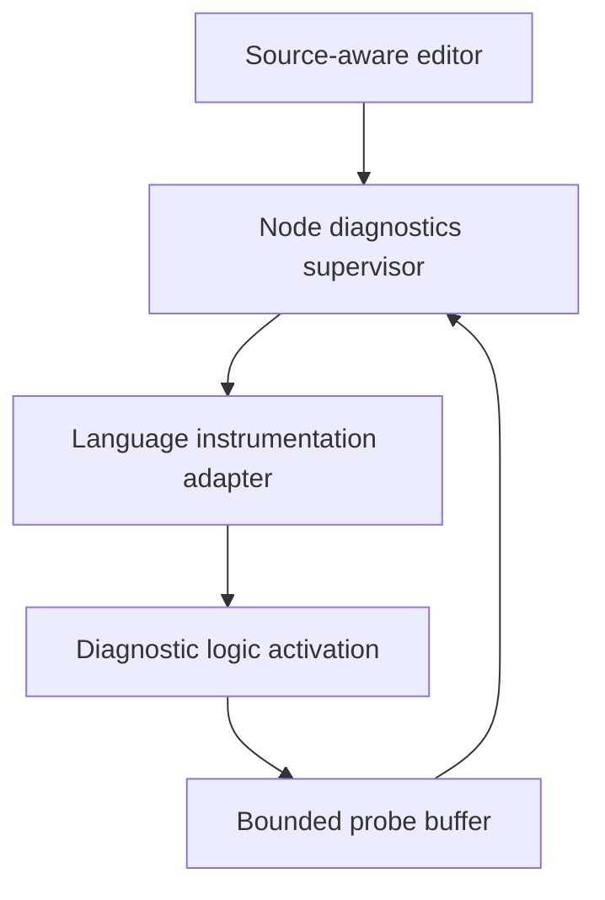

# Source RPC Node Live Diagnostics — Design Specification

*Status: consolidated design, 2026-08-26. Source-linked viewing of existing props and state is an
independently implementable first phase. Instrumented diagnostic variants depend on state-preserving
component replacement. Exact breakpoints and stepping are optional later capabilities requiring an
isolated, pausable logic execution context.*

## 1. Purpose

This specification defines a generic diagnostics capability for Source RPC nodes. An authorised
user viewing the exact active source revision can request:

- Live values displayed at their source locations
- Visibility of statements and branches executed during a defined window
- Tracepoints that capture values and execution context without stopping
- Breakpoints that pause at a safe boundary or at an exact source probe
- Source-level continue, step into, step over, step out, and run to cursor

The feature is language-neutral at the Source RPC protocol boundary. Each supported source language
provides an instrumentation adapter appropriate to its compiler tooling. TypeScript uses compiler
AST and semantic analysis; C# may use its syntax and semantic tooling; other languages may provide
equivalent adapters.

The design does not depend on V8, CLR, or another engine-specific debugger. Such debuggers may
remain optional implementation aids, but the Source RPC feature is defined through generated source
probes and a common node diagnostics protocol.

## 2. Architectural decisions

1. **Normal source remains canonical.** Diagnostics must not require users to write or execute a
   restricted IR.
2. **Instrumentation is requested on demand.** Deep observation produces a diagnostic derivative
   of the current semantic source revision, primarily around requested source regions.
3. **A derivative is not a semantic edit.** Removing the authorised generated instrumentation must
   yield exactly the active source revision.
4. **Existing props and state are the simplest live values.** A normal build may emit source
   bindings for them without adding runtime probes.
5. **Locals and execution paths require probes.** Language-specific compilation injects probes while
   preserving source semantics and evaluation order.
6. **Source RPC is the generic control and telemetry plane.** It carries capabilities, sessions,
   probe catalogues, aggregated values, execution data, pause state, and debugger commands.
7. **Diagnostic telemetry is not domain state.** Probe buffers, hit maps, and debugger sessions are
   excluded from component snapshots and state migrations.
8. **The supervisor remains responsive.** Exact suspension may block component logic but must not
   block the Source RPC diagnostics endpoint that controls it.
9. **Tracepoints are safer than breakpoints.** Non-stopping observation is the default. Exact pause
   is separately authorised and may be prohibited by node or environment policy.
10. **Active-source identity is strict.** Live values are never overlaid on edited or otherwise
    mismatching source as if that source were running.

## 3. Goals

- Present PLC-like online values beside source expressions
- Show code observed as executed or not observed in a precise window
- Support language-neutral observation and debugger clients
- Preserve the generality, sharing, testing, and code-generation benefits of normal source
- Reuse Source RPC component replacement for adding and removing instrumentation
- Keep the uninstrumented production artifact free of deep-probe overhead
- Bound CPU, memory, telemetry, and operational effects
- Make every diagnostic action permissioned, attributable, and revocable
- Degrade safely when instrumentation, replacement, or pause cannot be provided

## 4. Non-goals

- Native instruction-level debugging
- Arbitrary inspection of locals that were not captured by generated probes
- Serialising or migrating a paused execution stack
- Editing or forcing live variables
- Claiming that “not observed” means statically unreachable
- Guaranteeing zero timing effect from instrumentation
- Pausing hard real-time or safety-critical plant control
- Treating diagnostic telemetry as evidence that simulated behaviour matches the plant
- Requiring every Source RPC node or language to support every diagnostics level
- Silently restarting a node merely to satisfy a live-view request

## 5. Architecture



The diagnostics supervisor is a stable Source RPC endpoint. It authenticates users, reports
capabilities, coordinates diagnostic variants, retains session state, controls pauses, and publishes
bounded telemetry. Component logic executes separately so it can be replaced or paused without
making the supervisor unreachable.

Source text and build inputs may reside in an authorised build service rather than on the runtime
node. The node must nevertheless identify the exact semantic revision and artifact it is running.

## 6. Terminology

| Term | Meaning |
|---|---|
| **Semantic revision** | Approved source revision defining program behaviour |
| **Base artifact** | Normal compiled artifact for a semantic revision |
| **Diagnostic variant** | Artifact derived from the exact base source by adding authorised probes |
| **Source binding** | Mapping from a Source RPC prop/state path to source spans |
| **Probe** | Generated observation point associated with a source span and semantic meaning |
| **Probe plan** | Immutable requested set of source regions, values, execution points, and breakpoint policies |
| **Observation session** | Authorised, bounded user interaction with a node's diagnostics service |
| **Execution window** | Scan, invocation, logical-time range, or reset interval to which execution data refers |
| **Safe-boundary pause** | Pause requested at a probe but entered only after the current handler completes |
| **Exact pause** | Logic execution context suspended at the probe with its stack still live |
| **Debugger controller** | One session holding exclusive authority to resume or step a paused target |

## 7. Capability advertisement

Diagnostics are capability-negotiated. A client never assumes that a node contains source, supports
instrumentation, or can pause.

```ts
interface NodeDiagnosticsCapabilities {
  protocolVersion: number;

  sourceAvailable: boolean;
  sourceLinkedProps: boolean;
  sourceLinkedState: boolean;
  diagnosticVariants: boolean;

  valueProbes: boolean;
  statementHits: boolean;
  branchOutcomes: boolean;
  orderedTrace: boolean;

  tracepoints: boolean;
  safeBoundaryPause: boolean;
  exactPause: boolean;
  stepping: boolean;

  supportedLanguages: Array<{
    language: string;
    adapterVersion: string;
    supportedProbeKinds: ProbeKind[];
  }>;

  limits: {
    maxSessions: number;
    maxProbesPerSession: number;
    maxValueBytes: number;
    maxTraceEvents: number;
    maxPauseMs?: number;
  };
}
```

Capabilities may differ by component within a node. Policy may further reduce the capabilities
visible to a particular user or environment.

## 8. Source and revision identity

Every diagnostic request identifies the semantic revision it expects to observe:

```ts
interface ActiveSourceIdentity {
  componentId: string;
  semanticRevisionId: string;
  sourceBundleHash: string;
  baseArtifactHash: string;
  activationEpoch: bigint;
}
```

The editor must compare its document content with the active source hash.

- If it matches, inline live observation may proceed.
- If the user has unsaved or unactivated edits, the editor must show a mismatch and disable inline
  overlays on that document.
- The editor may open a read-only copy of the active source for diagnostics.
- Activating the user's edits is a semantic online change and follows the normal component-change
  protocol; it is never disguised as instrumentation.

Every probe definition and sample carries the semantic revision or refers to an immutable session
that fixes it. Data from an old activation may not be displayed on a newer revision based only on a
similar filename or line number.

## 9. Source-linked props and state

The simplest live view does not require a diagnostic variant. During a normal build, a language
adapter may emit bindings from Source RPC paths to exact source occurrences.

```ts
interface SourceBinding {
  semanticRevisionId: string;
  componentType: string;
  sourceRpcPath: string;
  fileId: string;
  spans: SourceSpan[];
  declaredType: string;
  sensitivity?: string;
}

interface SourceSpan {
  startLine: number;
  startColumn: number;
  endLine: number;
  endColumn: number;
}
```

The editor combines the binding catalogue with already observable props or state. This level can
display persistent domain values beside declarations and references while preserving the normal
artifact.

Each rendered value includes freshness and context. A value without a logical time, state revision,
or age must not appear indistinguishable from a current value.

This mechanism does not expose lexical locals or arbitrary expression results; those require probes.

## 10. Observation session

```ts
interface ObservationRequest {
  componentId: string;
  expectedSemanticRevisionId: string;
  sourceFileId: string;
  visibleSpan: SourceSpan;

  modes: Array<
    | "live-values"
    | "execution-hits"
    | "branch-outcomes"
    | "ordered-trace"
    | "breakpoints"
  >;

  requestedSymbols?: string[];
  requestedExpressions?: SourceSpan[];
  breakpoints?: BreakpointRequest[];
  executionWindow: ExecutionWindowRequest;
  requestedTtlMs: number;
}
```

Session lifecycle:

1. Authenticate and authorise the request.
2. Verify exact active-source identity.
3. Determine whether existing source bindings and an active diagnostic variant already satisfy it.
4. Expand the requested source region to safe instrumentation boundaries.
5. Generate or update the probe plan.
6. Build and validate a diagnostic variant when additional probes are required.
7. Activate the variant through state-preserving component replacement.
8. Publish the probe catalogue and begin bounded telemetry.
9. Update the session as the view or breakpoint set changes.
10. Close on user request, revocation, disconnect policy, or TTL expiry.
11. Remove unused instrumentation at a safe handoff boundary or retain a cached dormant variant
    under policy.

A request must not trigger a disruptive restart by default. If live replacement is unavailable, the
session falls back to the diagnostic levels already supported by the running artifact.

## 11. Region expansion

Raw viewport lines are not reliable instrumentation boundaries. A viewport may begin in the middle
of a condition, expression, or function.

The language adapter expands the region to include:

- Complete statements intersecting the viewport
- Containing functions or methods
- Conditions governing visible branches
- Function entry and exit
- Visible declarations, assignments, and requested expressions
- Branch targets that enter or leave the displayed region where needed for understandable paths

The default practical unit is usually the containing function rather than the literal line range.

Scrolling is debounced. An observation session accumulates a bounded union of required functions or
regions and does not rebuild on every viewport movement. Previously built probe-plan variants may be
cached by immutable hash.

## 12. Probe model

```ts
type ProbeKind =
  | "value"
  | "statement"
  | "condition"
  | "branch"
  | "function-entry"
  | "function-exit"
  | "breakpoint";

interface ProbeDefinition {
  probeId: string;
  semanticRevisionId: string;
  fileId: string;
  span: SourceSpan;
  kind: ProbeKind;

  symbolId?: string;
  displayText?: string;
  declaredType?: string;
  containingFunctionId?: string;
  sensitivity?: string;
}

interface ProbeSample {
  sessionId: string;
  probeId: string;
  semanticRevisionId: string;
  artifactVariantId: string;
  activationEpoch: bigint;

  invocationId?: string;
  executionWindowId: string;
  logicalTime?: bigint;
  observedAt: string;

  executionCount: number;
  conditionResult?: boolean;
  value?: DiagnosticValue;
}
```

Probe IDs are stable inside one semantic revision and probe-plan generation scheme. They are not
assumed stable across semantic source revisions unless an adapter explicitly supplies a verified
symbol identity mapping.

## 13. Language instrumentation adapter

```ts
interface SourceInstrumentationAdapter {
  describeCapabilities(): LanguageDiagnosticsCapabilities;

  buildSourceBindings(input: NormalBuildInput): Promise<SourceBinding[]>;

  createProbePlan(input: {
    sourceBundle: SourceBundle;
    request: ObservationRequest;
  }): Promise<ProbePlanResult>;

  buildDiagnosticVariant(input: {
    approvedBase: ApprovedSemanticRevision;
    probePlan: ProbePlan;
  }): Promise<DiagnosticBuildResult>;

  verifyDerivative(input: {
    approvedBase: ApprovedSemanticRevision;
    diagnosticBuild: DiagnosticBuildResult;
  }): Promise<DerivativeVerification>;
}
```

### 13.1 TypeScript adapter

The TypeScript adapter uses the compiler AST, type checker, and visitor/transformer pattern. It
records original source spans before emit and injects calls to a runtime-provided diagnostics helper.

Example:

```ts
// Approved semantic source
const flow = calculateFlow(level);

if (flow > limit) {
  stopPump();
}
```

```ts
// Generated diagnostic derivative
__sourceDiagnostics.hit("statement:1");

const flow = __sourceDiagnostics.value(
  "value:flow:1",
  calculateFlow(level),
);

if (__sourceDiagnostics.condition("condition:1", flow > limit)) {
  __sourceDiagnostics.hit("branch:1:true");
  stopPump();
}
```

The helper returns the original value. Source maps remain useful for emitted errors and stack traces,
but live source association comes from the explicit probe catalogue generated from the semantic AST.

### 13.2 Other languages

Each language adapter may use its normal syntax tree, semantic model, compiler plug-in, or approved
source-rewriting mechanism. It emits the same language-neutral probe catalogue and telemetry model.

An adapter may support only a subset of probe kinds. A binary-only node may support props/state and
runtime metrics without source-linked local values or execution paths.

## 14. Instrumentation safety invariants

Generated instrumentation must:

- Preserve the evaluation order of semantic expressions
- Evaluate each expression exactly once
- Preserve short-circuit behaviour
- Preserve `this`, receiver, exception, async, iterator, and disposal semantics
- Return the observed value unchanged
- Never throw into component logic
- Never await or perform unbounded work in a non-breakpoint probe
- Avoid unbounded allocation
- Write only to an injected, bounded diagnostics channel
- Contain no arbitrary network, filesystem, process, or plant access

Certain language constructs may not be safely instrumentable by a particular adapter. The adapter
must report the probe as unavailable rather than perform a transform of uncertain equivalence.

Every adapter has semantic-equivalence tests covering conditions, short-circuit expressions,
assignments, exceptions, async boundaries, destructuring, iterators, and language-specific edge
cases relevant to its supported probe set.

## 15. Diagnostic variant

```ts
interface DiagnosticVariantManifest {
  diagnosticManifestVersion: number;

  componentId: string;
  semanticRevisionId: string;
  sourceBundleHash: string;
  baseArtifactHash: string;

  artifactVariantId: string;
  artifactVariantHash: string;
  probePlanId: string;
  probePlanHash: string;

  contractHash: string;
  persistentStateSchemaHash: string;
  nonDiagnosticCapabilityHash: string;

  diagnosticsAdapter: {
    language: string;
    adapterVersion: string;
  };
}
```

Before activation, verification proves:

1. The source bundle is the exact approved active semantic revision.
2. Removing recognised generated probes produces the approved semantic AST or equivalent canonical
   representation.
3. RPC contract hash is unchanged.
4. Persistent state schema hash is unchanged.
5. Non-diagnostic capability requirements are unchanged.
6. The only added capability is the bounded diagnostics sink already permitted by node policy.
7. Probe catalogue, transformed artifact, and adapter version are immutable and hashed.

The diagnostic variant is separately identified for audit and runtime control but does not create a
new semantic source revision.

## 16. Activation through component replacement

Where Source RPC state-preserving component replacement is available:

1. Build and validate the diagnostic variant while the base activation runs.
2. Start the variant as a shadow activation with output authority fenced.
3. Reach the normal quiescence barrier.
4. Capture the component's handoff-valid snapshot.
5. Restore the identical persistent state schema; no semantic state migration is performed.
6. Re-establish runtime obligations under the normal handoff rules.
7. Atomically switch activation ownership and epoch.
8. Begin the observation session.

Replacing the diagnostic variant with the normal artifact uses the same protocol.

An exact-paused activation is not quiescent and cannot be replaced. It must first resume and reach a
normal handoff barrier. A specialised transactional simulator may support discard and deterministic
replay, but this is not part of the generic node guarantee.

## 17. Telemetry transport

Probe calls write to a node-local bounded buffer or latest-value table. They do not perform a Source
RPC call for every execution.

The diagnostics service exposes three kinds of information:

- **Props:** node capabilities, active source identity, immutable session configuration, probe
  catalogue, and source binding catalogue
- **State:** session health, active variant, pause state, latest values, counters, execution bitsets,
  dropped-sample counts, and freshness
- **Events:** breakpoint hits, tracepoint captures, and optional ordered trace chunks

High-frequency events are batched and sequenced. Backpressure may drop diagnostic samples according
to session policy but must never block or alter application behaviour except when an explicitly
enabled breakpoint is hit. Dropped data is counted and visible.

Diagnostic props/state are a separate namespace and are excluded from the component's persistent
domain snapshot.

## 18. Illustrative Source RPC contract

```ts
abstract class NodeDiagnostics {
  abstract readonly capabilities: NodeDiagnosticsCapabilities;
  abstract readonly activeSource: ActiveSourceIdentity;
  abstract readonly sessions: Record<string, ObservationSessionState>;

  abstract startSession(
    request: ObservationRequest,
  ): Promise<ObservationSessionDescriptor>;

  abstract updateSession(
    sessionId: string,
    update: ObservationSessionUpdate,
  ): Promise<ObservationSessionDescriptor>;

  abstract stopSession(sessionId: string): Promise<void>;

  abstract acquireDebuggerControl(
    sessionId: string,
  ): Promise<DebuggerControlLease>;

  abstract continueExecution(
    leaseId: string,
  ): Promise<void>;

  abstract step(
    leaseId: string,
    mode: "into" | "over" | "out" | "run-to-probe",
    targetProbeId?: string,
  ): Promise<void>;
}
```

The exact Source RPC class design may differ, but the protocol must retain explicit revision,
session, lease, deadline, and command classifications. Pause/resume and step commands are not
silently repeatable.

## 19. Live value semantics

### 19.1 Persistent values

Props and state represent persistent or externally observable values. The UI may display them at all
mapped source occurrences, subject to permissions and formatting limits.

### 19.2 Locals and expressions

Locals exist only during an invocation. A local probe displays the last captured value together with:

- Invocation ID
- Execution window
- Logical time or timestamp
- Age
- Execution count
- Stale/current status

The UI must not present a local from a previous invocation as the timeless current value.

### 19.3 Diagnostic value encoding

Values use a bounded, language-neutral representation supporting primitives, structured previews,
type names, truncation, redaction, and explicit unavailable/error states. Serialisation must handle
cycles and must not invoke arbitrary user getters merely to render a value.

Large objects are represented by summaries. Expansion requires a separate permissioned request and
remains subject to size, depth, and lifetime limits.

## 20. Execution visualisation

Execution visualisation has three increasing-cost levels:

1. **Hit bitmap:** whether each statement or branch probe executed in the selected window.
2. **Counters and outcomes:** hit counts, true/false condition counts, and loop counts.
3. **Ordered trace:** sequenced probes for one invocation or bounded time interval.

An execution window is explicit:

```ts
type ExecutionWindowRequest =
  | { kind: "latest-invocation" }
  | { kind: "latest-scan" }
  | { kind: "invocation"; invocationId: string }
  | { kind: "since-reset" }
  | { kind: "logical-range"; from: bigint; to: bigint };
```

The UI distinguishes:

- Executed in the selected window
- Not observed in the selected window
- Executed only in an older window and therefore stale
- Outside the instrumented area
- Requested but unavailable because safe instrumentation was impossible
- Unknown because samples were dropped

“Not observed” is never labelled as “unreachable” or “never executed.”

## 21. Tracepoints and breakpoints

```ts
interface BreakpointRequest {
  sourceSpan: SourceSpan;
  mode: "tracepoint" | "safe-boundary" | "exact";
  condition?: string;
  hitCount?: number;
  captureSymbols?: string[];
  messageTemplate?: string;
}
```

### 21.1 Tracepoint

Captures selected values, execution context, and path information and emits an event without
stopping. This is the default diagnostic mode and is appropriate in the widest range of nodes.

### 21.2 Safe-boundary breakpoint

When the probe is hit, the runtime records the hit and requests a pause. The current handler
completes under ordinary semantics, and the component pauses before accepting its next unit of work.

The UI must state clearly that execution stopped after the handler, not on the exact source line.
This mode preserves quiescence and is safer for general actor components.

### 21.3 Exact breakpoint

The probe captures the requested locals and logical execution context, notifies the supervisor, and
blocks the component's logic execution context until continue or step is authorised.

Exact pause requires:

- Logic execution isolated from the diagnostics supervisor
- A supported language/runtime pause gate
- Serialized or otherwise explicitly supported execution semantics
- Defined handling for input, deadlines, timers, leases, and watchdogs while paused
- A maximum pause duration and disconnect policy
- Explicit environment and user authority

Exact pause is disabled by default for production and any hard real-time or plant-control path.

### 21.4 Conditions and hit counts

Breakpoint conditions are compiled as part of the verified diagnostic derivative or evaluated by a
separately constrained expression mechanism. They may not use unrestricted runtime evaluation.

Changing a condition may require rebuilding the variant. Adding an unconditional stop policy to an
existing probe does not.

## 22. Pause architecture

An exact pause blocks the component logic execution context while the supervisor remains live.
Language implementations may use worker threads, dedicated component threads, cooperative runtime
gates, or equivalent mechanisms.

```ts
interface PauseState {
  pauseId: string;
  componentId: string;
  semanticRevisionId: string;
  artifactVariantId: string;
  activationEpoch: bigint;
  probeId: string;
  invocationId?: string;
  logicalTime?: bigint;
  pausedAt: string;
  expiresAt: string;
  controllerLeaseId?: string;
}
```

### 22.1 Pause scope

A node may advertise these scopes independently:

- `component`: pause one component logic context
- `node`: coordinate all participating components on the node
- `group`: request a domain coordinator, such as a simulation scheduler, to freeze a declared group

Group coordination is outside the generic node implementation but uses the same breakpoint event and
pause-control protocol.

### 22.2 Incoming work

The node declares one pause policy:

- Buffer bounded new inputs while preserving deadlines and order
- Refuse new work as temporarily paused
- Allow only supervisor-served diagnostic queries

The policy is visible before the user enables exact pause. Source RPC deadlines do not silently stop
because a component is paused unless a higher-level logical-time coordinator explicitly defines that
behaviour.

### 22.3 Work already in progress

An exact breakpoint may suspend a handler after state mutation or an external effect. Generic
rollback is impossible. Exact breakpoints may therefore be prohibited inside non-repeatable command
handlers or components with uncontrolled external side effects.

Caller-visible timeout and `UnknownOutcome` behaviour remains governed by the existing Source RPC
command model. A debugger must not silently retry the command.

### 22.4 Disconnect and expiry

Every exact pause has a bounded lease and deterministic expiry action configured by policy:

- Resume automatically
- Convert to a safe stopped state at the next supported boundary
- Terminate the diagnostic activation and surface affected work through normal failure semantics

Automatic resume is the default for simulations unless explicitly overridden. A disconnected
debugger must not leave a node paused indefinitely.

## 23. Logical stack and stepping

Generated function-entry and function-exit probes maintain a bounded logical frame stack for the
instrumented region. Statement probes provide source-level stepping points.

Debugger commands mean:

- **Continue:** resume until the next enabled exact breakpoint.
- **Step into:** resume until the next statement probe, including a deeper logical frame.
- **Step over:** resume until the next probe at the same or shallower frame depth.
- **Step out:** resume until the current logical frame exits.
- **Run to cursor:** resume until a selected existing probe is reached.

This is source-level rather than native instruction-level stepping.

Initial support may be limited to synchronous serialized handlers. Async continuations require
explicit propagation of invocation and logical-frame context. If the adapter cannot preserve an
accurate logical stack through a construct, stepping through that construct is reported unsupported.

Only locals explicitly captured for the current probe or maintained in an authorised frame record
are inspectable. The feature does not promise arbitrary native-stack introspection.

## 24. Multiple sessions and debugger ownership

Several users may observe one component. The diagnostics manager may combine compatible probe plans
into one bounded union and build one shared diagnostic variant.

Rules:

- Each session receives only values and probes it is authorised to see.
- A broad union must not capture sensitive values merely because another session requested an
  unrelated region.
- Closing one session removes only its requirements.
- Rebuilds are debounced and cached by immutable probe-plan hash.
- At most one debugger controller lease may issue continue or step commands for a paused target.
- Other authorised sessions may remain read-only observers of the pause.
- Controller transfer is explicit and audited.

Where isolation cannot be guaranteed, the node may allow only one deep-observation session.

## 25. Security and authority

Diagnostics permissions are distinct:

- View active source identity
- Read source text
- View ordinary props/state
- View sensitive state fields
- Request local/expression probes
- View execution paths
- Create tracepoints
- Build and activate diagnostic variants
- Create safe-boundary breakpoints
- Create exact breakpoints
- Control a paused activation
- Retain diagnostic recordings

Starting an instrumented variant changes the executable artifact even though semantic source is
unchanged. It therefore requires deployment-grade derivative verification and explicit diagnostic
authority.

The injected diagnostics sink is a narrow pre-authorised capability. It cannot be used to gain
general RPC, broker, filesystem, network, or plant access. Capability checks are repeated for the
diagnostic artifact.

Values may disclose credentials, personal information, production quantities, algorithms, or other
confidential data. Source-level visibility is read-only but not harmless. Field classification,
redaction, size limits, and user scope apply before capture where possible, not only in the editor.

## 26. Performance and resource control

The normal uninstrumented artifact carries no deep-probe execution overhead. Source-binding metadata
for existing props/state is static.

Diagnostic variants enforce budgets for:

- Instrumented functions and probes
- Probe calls per execution window
- Value depth and byte size
- Ring-buffer memory
- Event rate and batch size
- Ordered-trace duration
- Build and swap frequency
- Pause duration

Non-breakpoint probes perform constant, bounded work and never block component logic. Latest-value
tables and execution bitsets are preferred over event-per-hit publication. Ordered traces are
explicitly requested, bounded, and expected to cost more.

If the telemetry consumer falls behind, diagnostic samples are dropped according to policy and the
drop count is published. Domain work is not backpressured by observation.

Instrumentation inevitably changes timing and may affect compiler optimisation. The UI displays that
the component is running a diagnostic variant. Admission policy may refuse a requested probe plan
whose estimated or measured overhead exceeds the component's budget.

## 27. Failure behaviour

| Failure | Required result |
|---|---|
| Active source does not match editor source | Refuse inline overlay and identify the active revision |
| Probe planning cannot safely instrument a construct | Mark that probe unavailable; continue with supported probes |
| Diagnostic build fails | Base activation remains active; session reports degraded capability |
| Derivative verification fails | Never activate the artifact; record the refusal |
| State-preserving handoff fails | Base activation remains authoritative |
| Probe helper or serializer encounters an unsupported value | Emit bounded unavailable/error metadata; never throw into domain logic |
| Telemetry buffer fills | Drop diagnostic data and increment visible counters |
| Observation client disconnects | Apply session TTL and pause-expiry policy |
| Exact-paused activation loses supervisor control | Execute the predeclared expiry action |
| User requests online change while exact-paused | Refuse until resume and a quiescent barrier |

## 28. Audit and evidence

Record:

- User and authority used to create the session
- Active semantic revision, source bundle, base artifact, and activation epoch
- Probe plan and source regions
- Adapter version and derivative verification result
- Diagnostic artifact and probe catalogue hashes
- Activation and removal handoffs
- Breakpoint creation, hit, controller acquisition, continue, step, expiry, and forced recovery
- Telemetry loss and resource-limit events
- Retained diagnostic recordings and their access history

Diagnostic observations describe what the instrumented software reported. They are not proof that
the plant behaved identically, and instrumentation timing effects remain part of the evidence.

## 29. Implementation phases

### Phase 1 — Source-linked props and state

Build:

- Capability advertisement
- Active source identity
- Normal-build source binding catalogue
- Editor overlays for already observable props/state
- Freshness, revision mismatch, permission, truncation, and redaction handling

Acceptance:

1. A value is displayed only beside source whose hash matches the active semantic revision.
2. Every value shows state revision/logical time or a clear age and stale status.
3. A user cannot obtain a field through source view that they cannot obtain through ordinary
   authorised observation.
4. Edited or mismatching source never receives misleading live overlays.
5. No runtime code instrumentation is required.

### Phase 2 — TypeScript diagnostic variants

Depends on state-preserving component replacement.

Build:

- TypeScript region expansion, AST probe planning, and transformation
- Derivative verification
- Value, statement, condition, branch, entry, and exit probes
- Bounded local buffer and Source RPC diagnostics telemetry
- State-preserving activation and removal of diagnostic variants
- Latest-invocation or latest-scan execution visualisation
- Tracepoints

Acceptance:

1. Removing generated probes reproduces the approved semantic AST.
2. Contract, persistent state schema, and non-diagnostic capabilities are identical to the base.
3. The component retains domain state while swapping to and from the diagnostic variant.
4. Supported expressions are evaluated exactly once with unchanged results and exception behaviour.
5. Unsupported constructs are refused at probe granularity.
6. Execution overlays distinguish not observed, stale, unavailable, and dropped data.
7. Closing the session removes or disables instrumentation at a safe boundary.

### Phase 3 — Breakpoints and source-level stepping

Build:

- Safe-boundary breakpoints
- Isolated pausable TypeScript logic worker
- Exact breakpoint gate and supervisor protocol
- Conditional and hit-count breakpoints
- Logical frame stack
- Continue, step into, step over, step out, and run to cursor
- Debugger controller lease, pause TTL, and disconnect recovery

Acceptance:

1. Exact pause suspends at the requested probe while diagnostics control remains responsive.
2. Resume continues the same live language stack without re-executing the observed expression.
3. Safe-boundary pause is clearly distinguished from exact pause.
4. New inputs, deadlines, leases, and watchdogs follow the advertised pause policy.
5. A lost controller cannot leave the component paused indefinitely.
6. A paused component cannot be hot-swapped until it resumes to a quiescent barrier.
7. Non-repeatable command behaviour is never silently retried or hidden by debugger operations.

### Phase 4 — Cross-language and coordinated debugging

Build when justified:

- Additional language instrumentation adapters, beginning with C# where needed
- Adapter conformance suite
- Cross-language diagnostic value encoding
- Node- and group-scoped pause coordination
- Async logical-stack propagation
- Optional retained trace sessions and replay integration

Acceptance requires different language nodes to expose equivalent probe, source, pause, and failure
semantics through the same Source RPC diagnostics protocol while accurately advertising unsupported
features.

## 30. Open design decisions

- Exact Source RPC contract shape and command classifications
- Location and trust boundary of the instrumentation build service
- Canonical source-bundle and semantic-AST comparison format
- TypeScript constructs supported in the first transformer
- Diagnostic value encoding and expandable-object lifetime
- Default region expansion and session-union policy
- Worker/process topology for exact pause
- Input buffering and deadline policy while paused
- Simulation group-pause coordination
- Production policies for tracepoints and safe-boundary breakpoints
- Artifact caching, TTL, and removal policy
- Performance budgets based on representative Source RPC nodes

## 31. Final design rule

> Treat live values, execution visualisation, tracepoints, breakpoints, and stepping as policies on
> source-linked probes. Generate those probes into a verified derivative of the exact active source,
> control them through a responsive Source RPC supervisor, and never sacrifice the generality of the
> node's normal programming language to obtain diagnostics.
