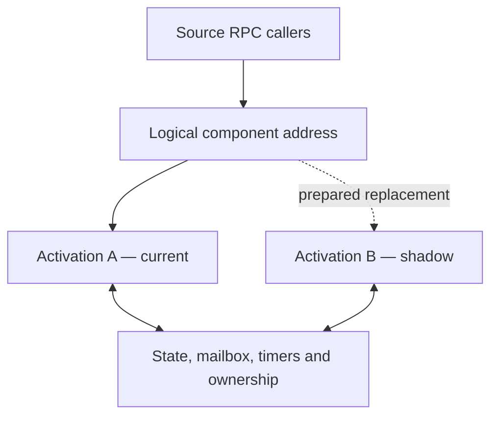

# Source RPC Persistent Components and Online Change — Design Specification

*Status: consolidated design, 2026-08-26. The snapshot and held-state migration subsystem is ready
for implementation. Managed obligation capture and live process replacement are specified here as
subsequent phases and must not be claimed before their acceptance criteria are met.*

## 1. Purpose

This specification defines how a logical Source RPC component can survive replacement of the
process and compiled program that implement it. A compatible arbitrary source-code change may be
compiled, prepared beside the running revision, and activated without stopping the surrounding
system or losing the component's declared persistent state.

The defining test is:

> Replace a running TypeScript implementation with an interface- and state-compatible C#
> implementation while callers continue addressing the same logical component.

The design generalises the useful property of PLC online change: the edit is not known beforehand.
After the edit has been made, the runtime classifies whether the old and new revisions can be
reconciled. Compatible changes are activated online; incompatible changes are refused with a
specific reason and may instead use a controlled restart.

## 2. Architectural decisions

1. **General-purpose source remains canonical.** TypeScript, C#, Rust, or another supported source
   language is compiled normally. TypeScript retains its normal module, package, testing, sharing,
   and code-generation model.
2. **Online change is conditional, not foundational.** All otherwise valid components may run.
   Only revisions satisfying the online-change profile qualify for live replacement.
3. **A change need not be anticipated.** The runtime knows generic compatibility rules, not the
   future source edit.
4. **Whole-component replacement is the primary mechanism.** A small edit may rebuild and replace
   the complete component activation. Compilation and startup occur while the old revision runs.
5. **Logical identity outlives an activation.** Callers address a persistent logical component,
   never a particular process.
6. **Persistent state is explicit and versioned.** State that must survive replacement cannot exist
   only in language-specific object layout, closures, stacks, or unmanaged background work.
7. **Handoff occurs at a consistent barrier.** State, obligations, message positions, and authority
   must describe the same logical instant.
8. **Authority is fenced.** At most one activation may commit state or outputs for a logical
   component epoch.
9. **Refusal is a successful safety outcome.** The runtime must reject a handoff it cannot prove it
   can perform under the declared rules.
10. **An IR interpreter is optional.** An IR may later support analysis, visualisation, restricted
    deterministic submodels, or code generation. It is not required for online change and must not
    replace general-purpose source merely to optimise an infrequent operation.

## 3. Scope

### 3.1 In scope

- Stable logical component identity and disposable activation identity
- Compiled shadow activation
- Contract, state, capability, and obligation compatibility classification
- Immutable versioned snapshots
- Deterministic forward state migrations
- Migration and handoff provenance
- Quiescent state capture at an input barrier
- Runtime-managed obligations
- Atomic activation ownership transfer and epoch fencing
- Caller-visible failure behaviour using Source RPC command semantics
- TypeScript-first implementation with a language-neutral path for C# and other languages
- Explicit rollback boundaries

### 3.2 Out of scope

- Hard real-time machine control
- Serialising or resuming arbitrary execution stacks, promises, threads, or CLR tasks
- Guaranteeing that new logic is correct for the plant
- Guaranteeing that every source edit qualifies for online change
- Exactly-once physical side effects in the general case
- Reverse state migrations
- Treating a handoff snapshot alone as a complete historical event journal
- Requiring an IR execution language
- Running a millisecond distributed scan as fine-grained RPC calls

## 4. Position in the system

Source RPC acts as the backplane above the hard real-time line. PLCs and Source Realtime retain
deterministic machine-control responsibilities. Persistent actors are suitable for simulation,
coordination, orchestration, services, supervision, and other workloads whose timing envelope
permits process and network boundaries.



The replaceable activation contains compiled application logic. The persistent runtime layer owns
or durably records the information that must survive it.

## 5. Terminology

| Term | Meaning |
|---|---|
| **Logical component** | Persistent address, contract, policy envelope, and state lineage visible to callers |
| **Activation** | One running process or isolated runtime instance implementing a logical component |
| **Revision** | Immutable compiled program artifact plus its manifest |
| **Activation epoch** | Monotonically increasing fencing value identifying the current activation |
| **Snapshot** | Immutable, consistent capture of held state and runtime-managed obligations |
| **Held state** | Explicit domain values that the component carries between handlers |
| **Obligation** | Runtime work or promise that must be assumed, re-established, completed, failed, or refused during handoff |
| **Barrier** | An ordered input position after which new work is buffered while the old activation becomes quiescent |
| **Commit point** | The point after which the new activation may accept input or publish authoritative output |

## 6. Source and execution model

### 6.1 Source remains general-purpose

The design does not introduce a restricted language for normal component logic. A TypeScript
component may continue to use classes, functions, generated source, shared packages, ordinary unit
tests, and permitted npm dependencies. C# and other implementations may use the equivalent normal
language facilities.

Sandbox policy remains capability-based. General-purpose source does not imply ambient filesystem,
network, process, broker, or plant access. The compiled activation runs in an appropriate isolated
process, container, microVM, or WebAssembly environment and receives only its approved capabilities.

### 6.2 The online-change profile

A component qualifies for automatic handoff only when it satisfies the following profile:

- Persistent domain state is exposed through the declared state schema.
- Ephemeral caches and reconstructed objects are not required in a snapshot.
- State-mutating handlers are serialised and run to completion.
- Timers, RPC calls, subscriptions, publications, leases, and ordering positions that must survive
  are created through runtime-managed APIs.
- There is no essential unregistered background work.
- The component can become quiescent within its declared handoff deadline.
- Restore and readiness checks have no externally authoritative side effects.

A component may use facilities outside this profile and still run normally. The consequence is that
an affected revision may require a controlled restart rather than online activation.

### 6.3 Arbitrary edits and post-edit classification

The content of an edit is unrestricted by the handoff mechanism. A revision is classified only
after it has been compiled and its manifest generated.

| Change | Expected classification |
|---|---|
| Calculation, condition, or internal helper changes with unchanged contract and state | Online-compatible |
| New state field with a reviewed initial value | Online-compatible with defaulting |
| State representation change with a deterministic migration | Online-compatible with migration |
| Removed active timer with no declared disposition | Refused |
| Changed RPC contract incompatible with current callers | Refused or coordinated deployment |
| Expanded capability request | Requires separate authority approval; never inherited silently |
| Unmanaged work that cannot become quiescent | Refused; controlled restart required |

### 6.4 Optional IR

An IR may be introduced later as one artifact type or as internal analysis tooling. Appropriate uses
include visualisation, behaviour comparison, code generation, restricted deterministic submodels,
and detailed tracing. It must use the same manifest, state, validation, and activation protocol as
compiled artifacts.

An IR is not a prerequisite for unforeseen online changes. A complete compiled revision can be
prepared off-path and switched at the same scheduler barrier.

## 7. Revision manifest

Every compiled artifact emits a machine-readable manifest. The TypeScript shape below is
illustrative; the canonical representation must be language-neutral before cross-language handoff
is enabled.

```ts
interface RevisionManifest {
  manifestVersion: number;

  componentType: string;
  revisionId: string;
  artifactType: "javascript" | "dotnet" | "wasm" | "native" | "source-ir";
  artifactHash: string;

  contract: {
    id: string;
    version: number;
    schemaHash: string;
  };

  state: {
    schemaId: string;
    version: number;
    schemaHash: string;
  };

  requiredCapabilities: string[];
  onlineChangeProfile: {
    supported: boolean;
    serialisedHandlers: boolean;
    runtimeManagedObligations: boolean;
    quiescenceDeadlineMs: number;
  };
}
```

The manifest describes the revision. It does not grant authority and is not accepted merely because
the component emitted it.

## 8. Identity, authority, and activation fencing

Four concerns must remain separate:

1. **Logical identity** names the persistent component.
2. **Identity policy** defines the maximum capability envelope permitted for that component.
3. **Artifact authorisation** approves a particular immutable revision for that identity.
4. **Activation ownership** identifies the one process currently allowed to act for the identity.

An interface-compatible replacement does not automatically receive authority. Its artifact hash,
contract, requested capabilities, and deployment approval are checked before preparation.

Activation ownership is represented by a linearizable record:

```ts
interface ActivationOwner {
  componentId: string;
  activationId: string;
  revisionId: string;
  epoch: bigint;
}
```

The transition from activation A at epoch E to activation B at epoch E+1 is an atomic
compare-and-swap. State writes, published outputs, and plant-facing actions carry the epoch. The
state store, router, broker gateway, and any output gateway reject an obsolete epoch.

Per-activation credentials should be short-lived or otherwise fenced. Retiring A in the registry is
not enough: a partitioned A must be technically unable to resume authoritative output later.

## 9. Snapshot envelope

```ts
interface SnapshotEnvelope<State> {
  snapshotFormatVersion: number;
  snapshotId: string;
  captureKind: "held-state-only" | "quiescent-handoff";

  componentType: string;
  componentId: string;
  sourceRevision: string;

  stateSchemaId: string;
  stateVersion: number;
  stateSchemaHash: string;

  activationEpoch?: bigint;
  logicalTime?: bigint;
  lastAppliedInputSequence?: bigint;
  lastCommittedOutputSequence?: bigint;

  heldState: State;
  obligations?: Obligations;
  provenance: MigrationRecord[];

  capturedAt: string;
  parentSnapshotHash?: string;
  contentHash: string;
}
```

Rules:

- `stateVersion` is written on the snapshot and never inferred.
- `componentType`, schema ID, schema version, and schema hash must all match the selected migration
  chain.
- A `quiescent-handoff` snapshot requires activation epoch, logical time, both sequence positions,
  and the complete obligations manifest. A `held-state-only` snapshot may omit them and can be used
  for state migration work, but never as sufficient input to a live activation handoff.
- Snapshots are immutable. Migration produces a new snapshot with lineage to its parent.
- `logicalTime` and sequence positions define ordering. `capturedAt` is human-facing metadata and
  must not be used as a simulation clock.
- The state payload is validated against its declared schema before migration and after every step.
- Canonical serialisation is required for stable hashes and cross-language use.
- A checksum detects corruption. Environments requiring audit-grade tamper evidence may additionally
  sign the snapshot and migration record.

## 10. Consistent capture

A valid snapshot must represent one consistent logical cut. Capturing fields and obligations in
uncoordinated succession is invalid.

For a planned handoff:

1. The router allocates barrier input sequence K.
2. Inputs after K are durably buffered and are not delivered to A.
3. A completes the one handler currently executing and all work required by the selected quiescence
   policy.
4. The runtime atomically records held state, obligations, input/output cursors, relevant
   idempotency records, and activation epoch.
5. The immutable snapshot is committed.
6. Migration and target restoration operate only on that committed snapshot.

The first implementation must not attempt to serialise a partially executed handler. If the
component cannot become quiescent before its deadline, the handoff is refused and A continues.

Where state transition, idempotency result, and publication must behave as one durable operation,
the runtime needs a transactional inbox/outbox boundary. An idempotency table alone cannot provide
exactly-once external side effects.

## 11. Held-state migration

### 11.1 Forward adjacent chain

There is one reviewed transform for each supported adjacent schema version. Migrating from vK to vN
applies K→K+1 through N−1→N in order. With V sequential versions this requires V−1 maintained
adjacent transforms rather than a direct transform for every version pair.

Each step returns one of:

| Outcome | Meaning | Effect |
|---|---|---|
| `total` | Old state fully determines new state | Apply |
| `defaulted` | A reviewed declared value supplies information absent from old state | Apply and record every default |
| `impossible` | Required information cannot be supplied under the approved rules | Refuse and name the field and reason |

An outcome may be value-dependent. Therefore a snapshot-specific dry run executes the migration
against an immutable copy; merely walking migration metadata is insufficient.

### 11.2 Migration rules

- Transforms are deterministic: no clock, randomness, environment, network, or ambient filesystem.
- Generated transforms are proposals. A schema diff may suggest a mechanical move or conversion but
  may not invent the value of a new field.
- Defaults and semantic conversions require human review and recorded approval.
- An impossible field raises an open question through the normal intake route. The recorded answer
  may result in a reviewed migration or default; it is never applied silently.
- Migration code executes in a restricted deterministic environment.
- Input and output schemas are validated for every step.
- Provenance records step ID and hash, reviewer/approval reference, fields transformed, values
  defaulted, and parent snapshot hash.
- Applying the same chain to the same canonical input must produce the same canonical output hash.
- The unmodified pre-migration snapshot is retained.

### 11.3 Migration testing

At minimum:

- One real golden snapshot is retained for every released state version.
- Every adjacent step runs against relevant golden snapshots on every build.
- Boundary and representative states supplement the single golden example.
- Property-based tests are used where a migration claims to be total over a broad schema.
- Broken paths, missing steps, schema mismatches, corrupt snapshots, and impossible values are tested.

A golden snapshot demonstrates a known case; it does not by itself prove that a transform is total.

### 11.4 Reverse migration and rollback

Reverse transforms are not required. The pre-migration snapshot permits abort or rollback only
until the new activation crosses the commit point.

After B accepts new input or publishes authoritative output, restoring A's old snapshot would lose
subsequent history and might repeat effects. Recovery after that point requires one of:

- Forward recovery through a new revision
- Durable input-journal replay into a compatible old revision
- A separately designed state-compatibility window

The specification must never describe a retained old snapshot as sufficient rollback after the new
revision has begun authoritative work.

## 12. Obligations manifest

Held state describes what the component knows. Obligations describe runtime-managed work it has
accepted, scheduled, awaited, or promised.

```ts
interface Obligations {
  subscriptions: SubscriptionObligation[];
  pendingPublications: PublicationObligation[];
  timers: TimerObligation[];
  outboundCalls: OutboundCallObligation[];
  inboundWork: InboundWorkObligation[];
  leases: LeaseObligation[];
  sequences: SequenceObligation[];
  watchdogs: WatchdogObligation[];
}
```

Every obligation has a stable semantic ID independent of a language object or function pointer.
The manifest of live instances is generated by the runtime. The target revision separately declares
which obligation IDs and versions it knows how to restore. This preserves the distinction between:

- **Observed fact:** the runtime knows that timer `mix-dwell` is active.
- **Reviewed policy:** the target declares what continuing, restarting, or firing that timer means.

The runtime can claim completeness only for components that use its managed APIs exclusively for
handoff-relevant work. Raw timers, threads, sockets, mutable module globals, or hidden promises make
automatic handoff ineligible unless the component explicitly drains and reconstructs them.

### 12.1 Resolution outcomes

Each obligation resolves during restoration as:

| Outcome | Meaning |
|---|---|
| `assumed` | Continuity is preserved under an explicitly supported rule |
| `reestablished` | The resource is recreated with declared delivery and ordering consequences; provenance records this fact |
| `completed` | Quiescence completed the obligation before capture |
| `failed` | Existing Source RPC failure semantics are delivered to the responsible caller |
| `unhonourable` | The target cannot preserve or safely resolve it; handoff is refused |

### 12.2 Timers

A timer records at least:

```ts
interface TimerObligation {
  id: string;
  clock: "simulation" | "monotonic" | "wall";
  dueAt: bigint;
  capturedAt: bigint;
  periodic?: {
    interval: bigint;
    missedTickPolicy: "skip" | "coalesce" | "catch-up";
  };
}
```

Every timer has an explicit restore policy:

- `preserve-deadline`: handoff time counts against it.
- `preserve-remaining`: it is effectively paused during handoff.
- `restart`: begin its declared duration again.
- `fire-on-activation`: deliver it immediately after B becomes authoritative.
- `refuse-if-overdue`: abort if its deadline passed during preparation.

There is no default timer policy. For deterministic simulation, the runtime should normally own the
logical clock, making preservation independent of wall-clock skew between hosts.

### 12.3 Calls and inbound work

The first live-handoff implementation is deliberately conservative:

- A state-mutating inbound handler must complete before capture.
- A non-repeatable outbound command must reach a definitive durable state or cause handoff refusal.
- Queries and idempotent commands may be retried only under their existing Source RPC rules and with
  the original request identity.
- A partially executed stack is never transferred.

`UnknownOutcome` remains the caller-facing representation of a command that may have run but lacks
a definitive result. It is not a mechanism for reconstructing the successor's internal workflow,
and it does not authorise silent retry.

### 12.4 Subscriptions and sequences

Subscriptions attach to the logical component, not permanently to an activation. A restored
subscription includes its last acknowledged sequence or durable cursor. Re-establishment must
declare whether the underlying transport may duplicate or omit delivery and how deduplication or
replay is performed.

Observable consumers likewise follow the logical address and continue from an ordered revision or
sequence. They must not see a false state reset merely because the physical process changed.

### 12.5 Leases

Domain leases held by the logical component may be transferred only when their issuer explicitly
supports logical-owner continuation. The activation ownership lease is never assumed intact: it is
reissued as epoch E+1 so that A is fenced.

## 13. Compatibility and validation

Source RPC's existing contract checks, command classifications, deadlines, idempotency behaviour,
ordering, and unknown-outcome semantics are important inputs but do not alone prove handoff
admissibility.

Validation occurs in four stages.

### 13.1 Static revision validation

Performed immediately after compilation:

- Artifact integrity and approval
- Contract compatibility, including inputs, outputs, errors, events, and command classification
- State schema chain availability
- Capability request within the identity policy envelope
- Target restore declarations for known obligation types and IDs
- Online-change profile conformance

### 13.2 Snapshot-specific dry run

Performed against an immutable snapshot or representative current clone:

- Execute the migration chain without publishing its result
- Validate each intermediate schema
- Report total, defaulted, and impossible fields
- Test target restoration with authoritative output disabled
- Run component readiness checks

### 13.3 Shadow verification

Where suitable, B receives a recorded input window or cloned simulation state and its outputs are
compared with expected or reviewed behaviour. A difference is evidence for review, not automatic
proof that either revision is correct.

### 13.4 Barrier-time validation

Because obligations can change after an earlier check, final validation is repeated on the
quiescent snapshot captured at K. Time-of-check cannot be treated as time-of-use.

The final result is one of:

| Classification | Meaning |
|---|---|
| `admissible` | May activate under already approved rules |
| `admissible-with-recorded-consequences` | Defaults or re-established obligations require visible provenance and any configured approval |
| `temporarily-blocked` | Current live work prevents handoff; retry may later succeed |
| `refused` | Contract, state, authority, or obligation cannot be reconciled |

Every refusal identifies the exact contract item, state field, capability, obligation, or live-work
condition responsible.

## 14. Online-change protocol

### 14.1 Prepare

1. Compile immutable revision B and generate its manifest.
2. Run static validation and required approvals.
3. Start B using a new activation ID with authoritative outputs disabled.
4. Optionally restore a recent snapshot and run dry-run or replay verification.
5. A continues serving callers throughout preparation.

### 14.2 Quiesce and capture

1. The coordinator establishes barrier K.
2. The router buffers new inputs after K.
3. A drains work required by the quiescence policy.
4. The runtime atomically commits A's consistent snapshot.
5. If quiescence or capture fails, discard B and return routing to normal A operation.

### 14.3 Restore

1. Validate and migrate the committed snapshot for B.
2. B restores held state.
3. B assumes or re-establishes every declared obligation with outputs still fenced.
4. B performs readiness checks.
5. Any impossible or unhonourable item aborts before ownership changes.

### 14.4 Activate

1. Atomically compare-and-swap ownership from A/E to B/E+1.
2. Route the logical address to B.
3. Enable B's E+1 state and output authority.
4. Release buffered inputs beginning with K+1 in order.
5. Fence and retire A.

### 14.5 Observe and commit

The coordinator records the activation, barrier, snapshot, migration, obligation dispositions,
epoch, artifact hashes, and approvals. A may remain warm but fenced for a bounded observation
period. Remaining warm does not grant post-commit rollback without replay.

## 15. Failure and rollback behaviour

| Failure point | Required result |
|---|---|
| Build, static validation, or shadow start fails | A remains active; no handoff occurs |
| Quiescence deadline expires | Handoff is temporarily blocked or refused; A resumes normal input |
| Snapshot or migration fails | A remains owner; immutable failure evidence is retained |
| B restore/readiness fails before ownership CAS | A remains owner; B is discarded |
| Ownership CAS fails | Neither routing nor output authority changes; reload current owner and retry or abort |
| B fails after CAS but before accepting K+1 | Ownership may return to A only through a new fenced CAS and verified unchanged state |
| B fails after authoritative work begins | Use forward recovery or journal replay; do not restore A's stale snapshot blindly |

The supervisor has new internal lifecycle states, but callers continue seeing existing Source RPC
transport, timeout, idempotency, and unknown-outcome semantics. A non-repeatable command is never
silently re-executed because a process changed.

## 16. Routing and cross-language contracts

Callers address a logical component name. They must not retain an activation-specific destination
beyond the routing epoch. The router or broker-facing gateway resolves the current activation and
stamps or verifies the epoch.

Cross-language replacement requires a canonical contract independent of TypeScript or C# class
layout. It must define:

- Stable method, event, property, and field identifiers
- Input, output, and error schemas
- Integer widths, floating-point rules, decimal representation, and time units
- Absent versus null values
- Enum evolution and unknown values
- Command classification and retry rules
- Ordering and concurrency guarantees
- State and snapshot serialisation

Language-specific classes are generated or checked views of this contract. They are not the only
canonical representation once cross-language handoff is supported.

## 17. Performance model

Compilation and process startup are outside the cutover path because B is prepared while A runs.
The visible handoff cost consists primarily of:

- Reaching the barrier
- Draining permitted work
- Capturing and validating the final snapshot
- Restoring B
- Performing the ownership compare-and-swap

The unit of replacement should be a meaningful state-owning component rather than each signal or
logic operation. High-frequency data should be batched; the backplane should not issue one network
RPC per simulated signal per scan. Performance assumptions must be benchmarked against realistic
component sizes and transports.

This architecture does not claim hard real-time guarantees. Its boundary is specifically Source
RPC and its chosen transports, not a universal claim that deterministic distributed control is
physically impossible.

## 18. Observability and evidence

For every attempted change, retain:

- Old and new artifact and manifest hashes
- Contract, state, capability, and obligation compatibility reports
- Snapshot ID, state schema, barrier K, logical time, and epoch
- Migration steps, defaults, impossible fields, and approvals
- Re-established, completed, failed, and unhonourable obligations
- Ownership transition and activation health
- Caller-visible unknown outcomes associated with the handoff

Source RPC call/reply tracing and latency observation remain useful but do not replace state and
activation evidence.

An obligations manifest answers what the component was doing at the instant of its snapshot. To
answer "what was it doing at 03:14?" generally, the system additionally needs periodic snapshots
and/or an append-only journal of state, obligation, and activation transitions with defined
retention.

## 19. Implementation phases

### Phase 1 — Snapshot and held-state migration

Build now:

- Snapshot envelope and canonical serialisation
- State-schema registry and validation
- Adjacent deterministic forward migrations
- Total/defaulted/impossible results
- Dry-run execution
- Provenance and immutable lineage
- Golden, boundary, and failure tests

Phase 1 makes no claim of live process replacement or incident-time reconstruction.

Acceptance:

1. Every snapshot explicitly identifies component type, instance, source revision, state schema,
   capture kind, and integrity hash. A quiescent-handoff snapshot additionally identifies its
   activation epoch and logical input/output position.
2. A supported old snapshot reaches the current state version through the declared adjacent chain.
3. Provenance identifies every migration, transformed field, and defaulted value.
4. An unsuppliable value refuses with a precise field path and reason.
5. Dry-run and committed migration produce the same output hash for the same immutable input.
6. Every released migration path runs in CI against golden and boundary fixtures.

### Phase 2 — Managed runtime and consistent capture

Build after Phase 1:

- Serialised handler execution
- Input barriers and buffering
- Runtime-managed timers, calls, subscriptions, publications, leases, and sequences
- Atomic held-state and obligation capture
- Quiescence deadlines
- Restore declarations and timer policies

Acceptance:

1. A snapshot can never combine held state and obligations from different sides of a barrier.
2. Unregistered handoff-relevant work makes the component ineligible or is detected and refused.
3. An undeclared timer disposition refuses handoff.
4. In-flight non-repeatable work is drained to a durable result or blocks handoff.
5. Final validation is repeated against the barrier snapshot.

### Phase 3 — Shadow activation and fenced replacement

Build after Phase 2:

- Logical routing indirection
- Shadow activation
- Linearizable ownership record and epoch CAS
- Per-activation output fencing
- Ordered buffered-input release
- Coordinator lifecycle, failure recovery, and audit record

Acceptance:

1. Callers continue using the same logical component address across replacement.
2. A failed preparation cannot disturb A.
3. At most one epoch can commit state or output, including across partitions and delayed messages.
4. B processes exactly the buffered sequence following the captured barrier under the declared
   inbox semantics.
5. Failure after the commit point cannot invoke unsupported stale-snapshot rollback.

### Phase 4 — Cross-language and historical continuity

Build when justified:

- Canonical language-neutral contract and state schema
- Generated TypeScript and C# bindings
- Cross-language conformance fixtures
- Periodic snapshots and/or event journal
- Replay-assisted recovery
- Optional additional artifact types, including an IR where independently useful

Acceptance includes replacing a TypeScript activation with a C# activation using the same logical
identity, state, contract, sequence position, and authority envelope.

## 20. Open design decisions

- Canonical contract and state-schema format
- Migration representation: constrained TypeScript, declarative DSL, WebAssembly, or another
  deterministic sandboxed form
- State-store transaction boundary with inbox, idempotency results, and outbox
- Linearizable owner store and broker-routing integration
- Exact managed-runtime API for TypeScript and C#
- Snapshot and journal cadence, retention, compaction, and tamper evidence
- Approval policy for defaults, semantic migrations, and re-established obligations
- Performance targets and component sizing based on measurement

## 21. Final design rule

> Preserve the generality and simplicity of normal source code. Make online change an additional,
> evidence-backed activation path for revisions whose state, contract, authority, and live
> obligations can be reconciled. When they cannot, refuse clearly and retain the ordinary controlled
> restart path.
